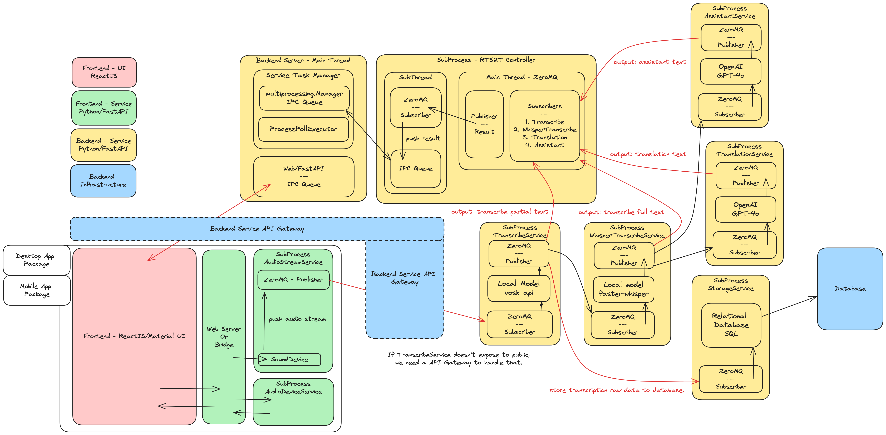

hala-trans
----------

hala-trans is a Real-Time Audio Translate AI Assistant.

The architecture of the hala-trans is primarily divided into the following services:

1. **Backend Server:** Uses FastAPI to communicate with subprocesses through IPC Queue and manages subprocesses via ProcessPoolExecutor.
2. **RTS2T Controller Service:** A subprocess service responsible for coordinating data from all other subprocess services and providing it to the backend server.
3. **Audio Stream Service:** Provides voice stream data.
4. **Transcribe Service:** Utilizes Vosk for real-time speech-to-text transcriptions.
5. **Whisper Transcribe Service:** Uses the Faster Whisper model for intermittent transcription of voice data. The transcriptions from this service are considered the final results. The Whisper model has higher accuracy than Vosk but is slower, hence, there are two transcription services.
6. **Translation Service:** Uses GPT-4o to translate the transcribed text.
7. **Assistant Service:** Uses GPT-4o to analyze the transcribed text and provide assistance and suggestions.

Communication between subprocesses is achieved using ZeroMQ's PUB/SUB model. Each subprocess service can be deployed independently, and load balancing of subprocess services can be implemented by combining XSUB/XPUB with PUSH/PULL models.





Requirements
------------

```plain
Python 3.11
poetry 1.8.0
```

Install & Run Background Service
--------------------------------

```shell
# if you're using conda, use conda create -n myproj python=3.11 to obtain python 3.11 environment

poetry install

make run

```

Run WebUI
---------

```shell

cd webui/app

npm install 
npm run start 
```